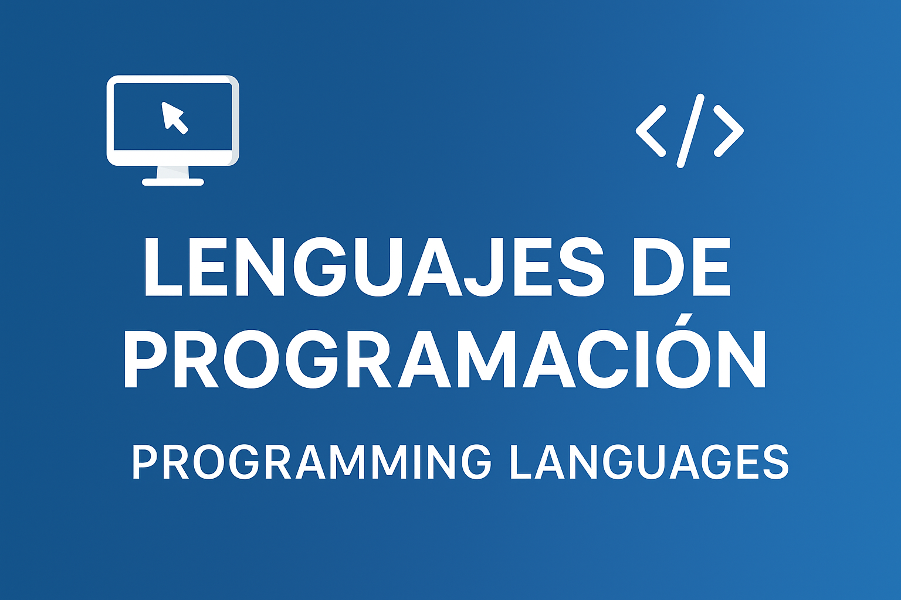

  

# 💻 Lenguajes / Languages

En esta sección encontrarás ejercicios y proyectos en diferentes **lenguajes de programación** como Java, Python, Kotlin, C#, JavaScript, entre otros.

### 🎯 Qué aprenderás:
- Sintaxis básica y estructuras de control.  
- Tipos de datos, operadores y funciones.  
- Buenas prácticas de codificación y estilo.  
- Comparación entre distintos lenguajes.
