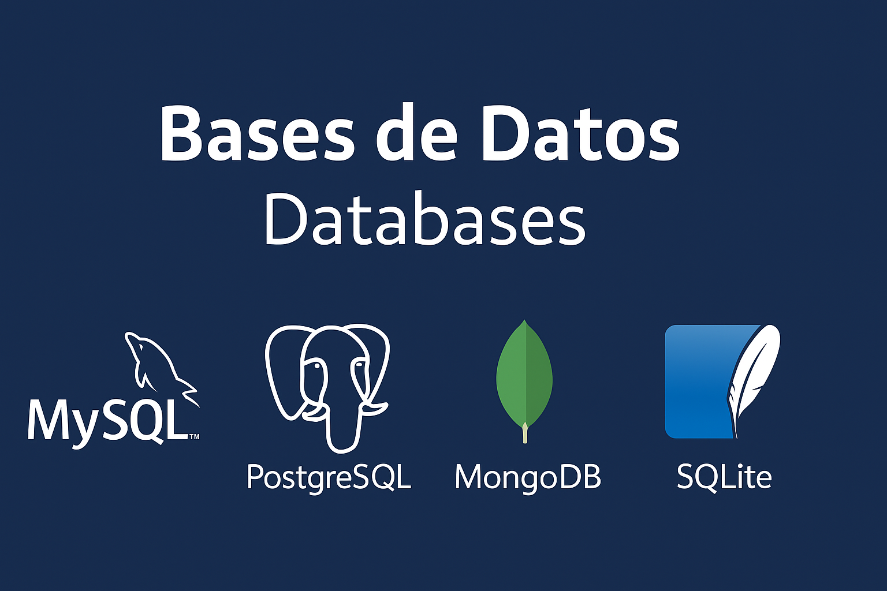

  

# 🗃️ Bases de Datos / Databases

Aquí se incluyen prácticas y scripts SQL para trabajar con **MySQL**, **PostgreSQL** y **MongoDB**, entre otros sistemas.

### 🎯 Qué aprenderás:
- Crear, modificar y consultar bases de datos.  
- Relaciones entre tablas y claves foráneas.  
- Consultas avanzadas, vistas y procedimientos almacenados.  
- Fundamentos de bases de datos relacionales y no relacionales.
