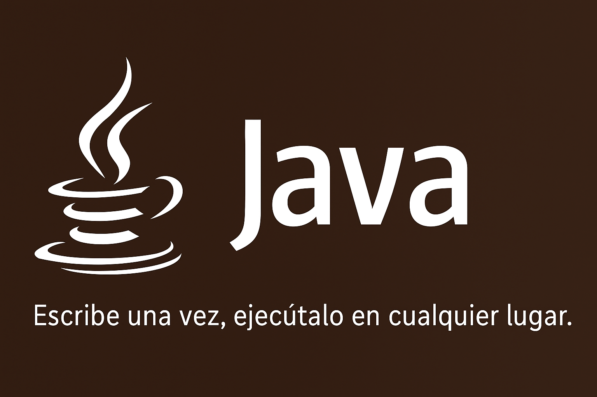

<p align="center">
  
</p>

# ☕ Java

> _“Escribe una vez, ejecútalo en cualquier lugar.”_  
> _“Write once, run anywhere.”_

---

## 🧩 Descripción | Description

Este repositorio es una **guía práctica de aprendizaje en Java**, desde los fundamentos hasta conceptos avanzados como POO, colecciones, manejo de archivos y concurrencia.  
Cada carpeta incluye ejemplos y ejercicios progresivos para reforzar la **lógica de programación** y las **buenas prácticas de código**.

---

## 📚 Estructura

| Carpeta | Contenido |
|----------|------------|
| 🧠 `basicos/` | Variables, operadores, bucles y estructuras de control. |
| ⚙️ `poo/` | Clases, objetos, constructores, herencia y polimorfismo. |
| 📚 `colecciones/` | Listas, mapas, sets, iteradores y genéricos. |
| 💾 `ficheros/` | Lectura y escritura de archivos con Streams y Buffers. |
| ❗ `excepciones/` | Manejo de errores, try-catch, throw y excepciones personalizadas. |
| 🧩 `ejercicios/` | Prácticas combinadas de todos los temas (de básico a avanzado). |

---

## 🧠 Recomendación de Estudio

1. Comienza con los archivos en `basicos/` para dominar la sintaxis.
2. Avanza a `poo/` para entender la Programación Orientada a Objetos.
3. Practica con `colecciones/` para trabajar con datos dinámicos.
4. Aprende a guardar y leer datos en `ficheros/`.
5. Maneja errores y excepciones en `excepciones/`.
6. Finalmente, resuelve los retos integradores en `ejercicios/`.

Cada archivo incluye:
- 📝 **Enunciado del ejercicio**
- 💡 **Solución comentada**
- ⚙️ **Código listo para ejecutar**

---

## ▶️ Cómo Ejecutar los Ejercicios

Asegúrate de tener **Java JDK 17+** instalado.  
Verifica tu versión con:

```bash
java -version
