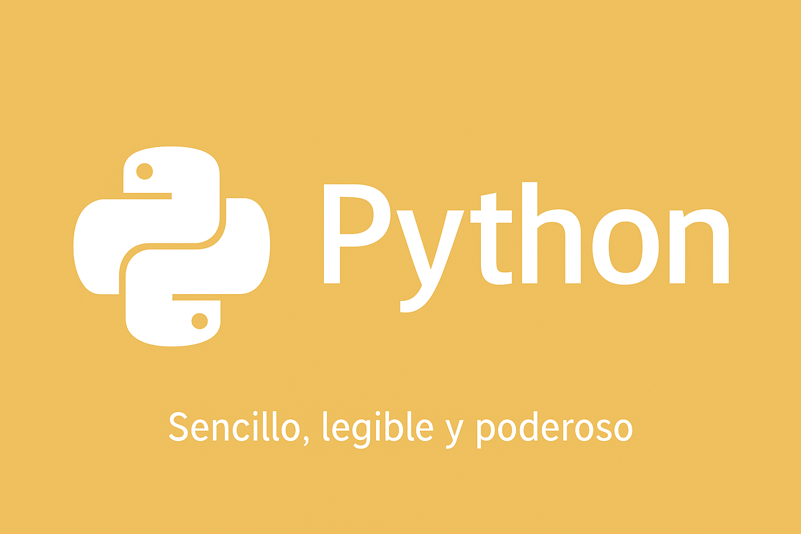

<p align="center">
  
</p>

# 🐍 Python

> _“Sencillo, legible y poderoso.”_

---

## 🧩 Descripción | Description

Aquí aprenderás los fundamentos del lenguaje **Python**, desde su sintaxis clara hasta el uso de funciones, clases y ficheros.  
Ideal para principiantes o quienes buscan desarrollar lógica y resolver problemas de manera elegante.  
Los ejercicios están diseñados para **progresar de lo más básico a técnicas avanzadas propias de Python**.

---

## 📚 Estructura

| Carpeta | Contenido |
|----------|------------|
| 🧠 `basicos/` | Sintaxis, variables, estructuras y bucles. |
| ⚙️ `funciones/` | Funciones, parámetros, recursividad, lambdas y comprehensions. |
| 🧱 `poo/` | Clases, objetos, herencia y encapsulación. |
| 💾 `ficheros/` | Lectura y escritura de archivos de texto. |
| 📦 `modulos/` | Creación e importación de módulos, uso de `__name__ == "__main__"`. |
| 🌟 `bonus/` | Decoradores, *args, **kwargs*, dict comprehensions y técnicas avanzadas pythonicas. |

---

## 📝 Ejercicios

Se incluyen **30 ejercicios** progresivos, que abarcan:  

1. Sintaxis básica y variables  
2. Estructuras de control (`if`, `for`, `while`)  
3. Listas, tuplas, diccionarios y sets  
4. Funciones simples y avanzadas (recursión, lambda, comprehensions)  
5. Programación orientada a objetos  
6. Manejo de archivos (`open`, lectura, escritura, append)  
7. Creación y uso de módulos  
8. Bonus: técnicas avanzadas pythonicas (decoradores, *args, **kwargs*, dict comprehensions)

---

## 🧠 Recomendación

- Empieza con `basicos/` y avanza gradualmente.  
- Practica copiando y ejecutando los ejemplos para entender su funcionamiento.  
- Después intenta modificar los ejercicios para experimentar con nuevas soluciones.  
- Usa la carpeta `bonus/` una vez tengas confianza con los conceptos básicos y medios.  
- Combina los ejercicios de distintas carpetas para hacer **mini-proyectos**.  

---

## 📥 Descarga y ejecución

- Todos los ejercicios están listos para ejecutar directamente en Python 3.x.  
- Para probar un ejercicio, abre el archivo `.py` correspondiente y ejecútalo con:

```bash
python nombre_del_archivo.py
