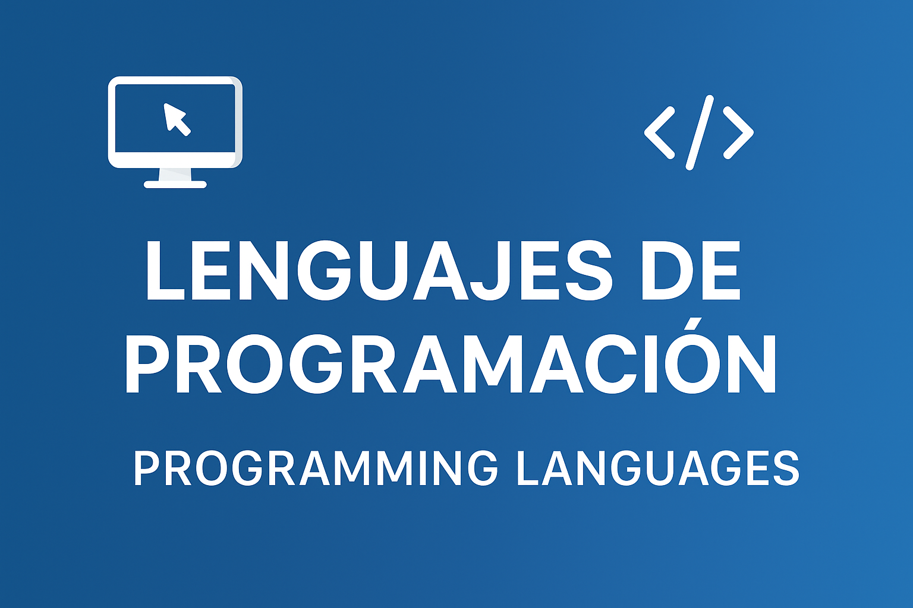

  

# 💻 Lenguajes / Languages

> _“Aprender un lenguaje nuevo es como ganar una nueva forma de pensar.”_  
> — Bjarne Stroustrup

---

## 🎯 Qué aprenderás

En esta sección encontrarás **ejercicios, proyectos y teoría práctica** sobre distintos lenguajes de programación.  
Cada carpeta incluye:
- 🧠 **Temario.md** — Guía teórica por niveles.  
- 🧩 **Ejercicios/** — Ejemplos prácticos del lenguaje.  
- 📘 **Recursos.md** — Enlaces y material de apoyo.  

Este módulo está orientado tanto al **aprendizaje educativo** como a la **aplicación profesional**, ideal para consolidar bases sólidas en cada lenguaje.

---

## 🗂️ Lenguajes disponibles

| Lenguaje | Descripción | Estado |
|-----------|--------------|--------|
| 🐹 [**Go**](_01_Languages/Go) | Lenguaje moderno de Google, rápido y concurrente. Ideal para APIs, servicios y backend. | ✅ Completo |
| 🐘 [**PHP**](_01_Languages/PHP) | Lenguaje backend esencial para desarrollo web y CMS. Ejercicios prácticos con CRUD, sesiones y formularios. | 🚧 En desarrollo |
| 🦀 [**Rust**](_01_Languages/Rust) | Lenguaje seguro y eficiente. Ejercicios enfocados en CLI, concurrencia y manipulación de archivos. | ✅ Completo |
| ☕ [**Java**](_01_Languages/Java) | Pilares de POO, colecciones, herencia y proyectos prácticos. | ✅ |
| 🐍 [**Python**](_01_Languages/Python) | Lenguaje versátil con ejemplos en IA, automatización y estructuras de datos. | ✅ |
| 💜 [**Kotlin**](_01_Languages/Kotlin) | Lenguaje moderno de Android y backend, orientado a la productividad y seguridad. | ✅ |
| ⚙️ [**C#**](_01_Languages/CSharp) | Lenguaje robusto usado en .NET y Unity. Ejercicios enfocados en POO y estructuras. | ✅ |
| 🌐 [**JavaScript**](_01_Languages/JavaScript) | Fundamentos de programación web, DOM y lógica. | ✅ |

---

## 🧩 Estructura recomendada

Cada lenguaje sigue la siguiente estructura:

